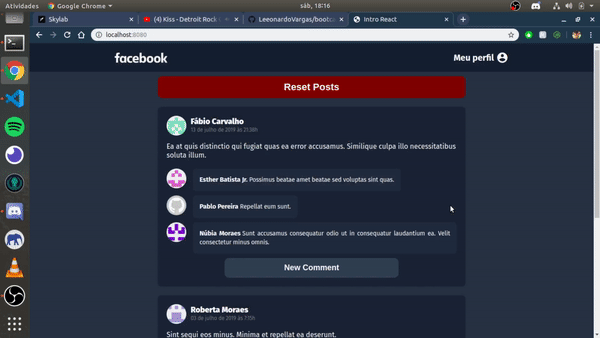

# bootcamp-atividades

Esse repositório contém todos os desafios de cada módulo do bootcamp.

## Desafio 01
**Conceitos NodeJS:** Criar uma aplicação para armazenar projetos e suas tarefas do zero utilizando Express. [README COMPLETO](https://github.com/Rocketseat/bootcamp-gostack-desafio-01/blob/master/README.md#desafio-01-conceitos-do-nodejs)

## Desafio 04
**Intro React:** Criar uma aplicação do zero utilizando Webpack, Babel, Webpack Dev Server e ReactJS. O objetivo da aplicação é sumilar o feed do Facebook com Post e Comentários.
[README COMPLETO](https://github.com/Rocketseat/bootcamp-gostack-desafio-04/blob/master/README.md#desafio-04-introdu%C3%A7%C3%A3o-ao-react)

## Desafio 05
**Repositórios Github:** Criar uma aplicação para adicionar repositórios do github e armazenar no localStorage. Ao selecionar um repositório a rota /repository deve mostrar as informações e os issues do repositório em questão, também é possível filtrar e paginar os issues.
[README COMPLETO](https://github.com/Rocketseat/bootcamp-gostack-desafio-05/blob/master/README.md)

## Desafio 06
**Perfis Github:** Criar uma aplicação com o React-Native onde o usuário possa adicionar contas do github. Ao ver o perfil de uma conta, é listado os repositórios favoritados pela mesma. Ao clicar em um repositório é carregado é suas informações via webView.
[README COMPLETO](https://github.com/Rocketseat/bootcamp-gostack-desafio-06/blob/master/README.md#desafio-06-aplica%C3%A7%C3%A3o-com-react-native)
